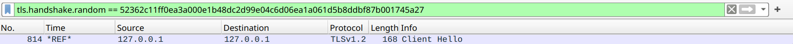

# CTF Semana #13 (Find-my-TLS)

## TLS

O protocolo `TLS` é um protocolo de segurança que permite a comunicação segura entre duas entidades. Este protocolo é usado em aplicações como o `HTTPS`, `SMTPS`, `FTPS`, etc.
Um uso comum do `TLS` é o `HTTPS`, que é usado para a comunicação segura entre um cliente e um servidor web. Este protocolo é usado para garantir a confidencialidade e integridade dos dados trocados entre o cliente e o servidor.

## Introdução

Para este CTF é-nos fornecido um ficheiro `dump.pcapng` que contém uma grande quantidade de conexões TLS. A flag será construída a partir de vários detalhes de uma conexão específica.
A conexão específica que devemos procurar usa o número aleatório `52362c11ff0ea3a000e1b48dc2d99e04c6d06ea1a061d5b8ddbf87b001745a27` na mensagem `Client Hello` do handshake.

Sabemos que a estutura da flag será:

flag{`<frame_start>`-`<frame_end>`-`<selected_cipher_suite>`-`<total_encrypted_appdata_exchanged>`-`<size_of_encrypted_message>`}

Onde:
- `<frame_start>` e `<frame_end>` são o primeiro e último (respetivamente) números de frame correspondentes ao procedimento de handshake do TLS.
- `<selected_cipher_suite>` é a ciphersuite escolhida para a conexão TLS (o nome, não o código)
- `<total_encrypted_appdata_exchanged>` é a soma total do tamanho dos dados cifrados trocados neste canal, até à sua terminação.
- `<size_of_encrypted_message>` é o tamanho da mensagem cifrada no handshake que concluí o procedimento de handshake.

## Resolução

Usamos o `Wireshark` para analisar o ficheiro `dump.pcapng`. Começámos por aplicar o filtro `tls.handshake.random == 52362c11ff0ea3a000e1b48dc2d99e04c6d06ea1a061d5b8ddbf87b001745a27` para filtrar apenas a conexão que usa o número aleatório que nos foi dado.

Através do resultado obtido, conseguimos rapidamente analisar que o _handshake_ começa no frame 814. Conhecendo também o funcionamento do protocolo `TLS` sabemos que o _handshake_ termina quando o servidor envia um `New Session Ticket` para o cliente informando que está pronto para receber dados. O frame 819 é o frame correspondente a este procedimento.

Para sabermos que `ciphersuite` devemos analisar a frame 814 e, na layer TLS procurar o campo `Cipher Suite`. Neste caso, o valor é `TLS_RSA_WITH_AES_128_CBC_SHA256`:

Por fim, para sabermos o tamanho total de dados cifrados trocados devemos ver os dois frames `Application Data` que precedem o _handshake_ e somar os seus tamanhos (campos `Length`):

| | | 
| --- | --- |
|  |  |

Somando os dois valores obtemos `1264`.

Por fim, para sabermos o tamanho da mensagem cifrada no _handshake_ que concluí o procedimento de _handshake_ devemos ver o frame 818 e ver o valor do campo `Length` que é `80`.

Com todos os valores obtidos, a flag é:

`flag{814-819-TLS_RSA_WITH_AES_128_CBC_SHA256-1264-80}`

