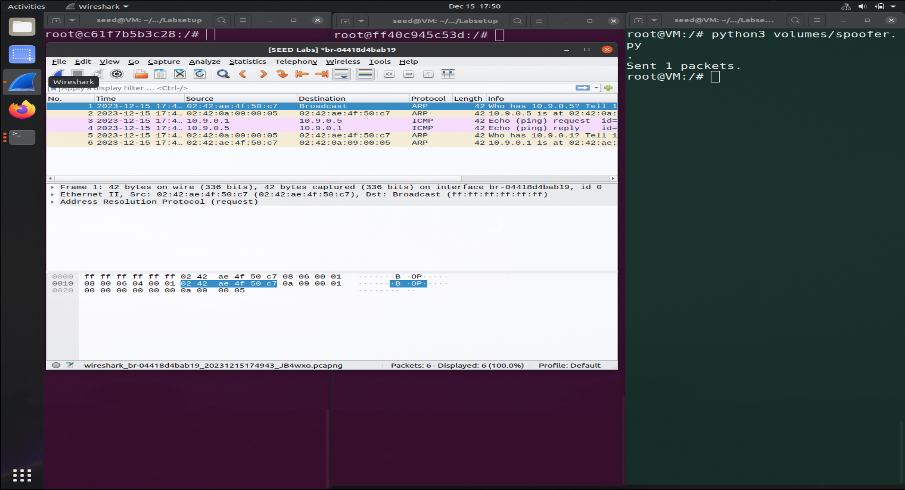
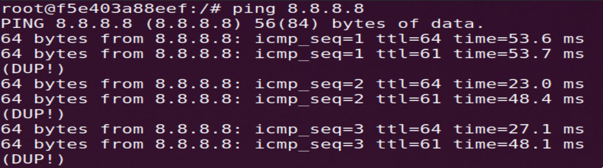
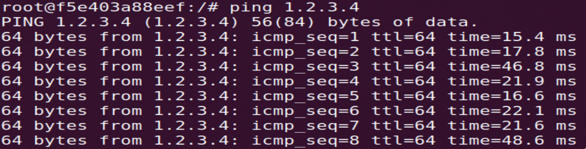
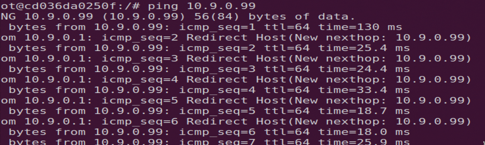

# Semana #13

## Sniffing and Spoofing

Neste lab vamos aprender a intercetar e manipular tráfego de rede. Para isso vamos usar o Wireshark e o Scapy.
De modo a podermos fazer as tarefas deste lab temos de correr três containers de docker em simultâneo ligados à mesma rede. Dois serão usados para simular duas máquinas e o terceiro será o attacker. 

### Tarefa 1 - Using Scapy to Sniff and Spoof Packets

### Tarefa 1.1 - Sniffing packets

#### Tarefa 1.1A

Neste tarefa é-nos pedido para intercetar os pacotes enviados entre duas máquinas. Para isso usamos o seguinte script de python:

```python
def print_pkt(pkt):
pkt.show()
pkt = sniff(iface=’br-c93733e9f913’, filter=’icmp’, prn=print_pkt) 
```

O valor de `iface` é o nome da interface de rede que queremos intercetar. Podemos descobri-lo através do comando ifconfig. 

<details>
    <summary># ifconfig</summary>
    
```bash
br-04418d4bab19: flags=4163<UP,BROADCAST,RUNNING,MULTICAST>  mtu 1500
        inet 10.9.0.1  netmask 255.255.255.0  broadcast 10.9.0.255
        inet6 fe80::42:76ff:fe97:bbbd  prefixlen 64  scopeid 0x20<link>
        ether 02:42:76:97:bb:bd  txqueuelen 0  (Ethernet)
        RX packets 46  bytes 3416 (3.4 KB)
        RX errors 0  dropped 0  overruns 0  frame 0
        TX packets 58  bytes 6674 (6.6 KB)
        TX errors 0  dropped 0 overruns 0  carrier 0  collisions 0
```
</details>

De seguida, devemos correr o comando `ping` da máquina 1 para a máquina 2. Se na máquina 3 estiver a correr o script de python, podemos ver os pacotes a serem intercetados: 


#### Tarefa 1.1B

Neste tarefa pedem-nos para capturar pacotes específicos enviados entre as duas máquinas:

1. Capturar apenas pacotes ICMP

```python
pkt = sniff(
    iface='br-04418d4bab19', 
    filter='icmp', 
    prn=print_pkt
    )
```

2. Capturar apenas pacotes TCP com destino à porta 23

```python
pkt = sniff(
    iface='br-04418d4bab19', 
    filter='tcp and src host 192.168.1.100 and dst port 23', 
    prn=print_pkt
    )
```

3. Capturar apenas pacotes que vão ou vêm de um determinado subnet (que não o da nossa máquina)

```python
pkt = sniff(
    iface='br-04418d4bab19', 
    filter='(net 128.230.0.0/16)',
    prn=print_pkt
    ) 
```

### Tarefa 1.2 - Spoofing packets

Nesta tarefa recorremos ao seguinte código: 

```python
a = IP()
a.dst = '10.9.0.5'
b = ICMP()
p = a/b
send(p)
```
Ao especificarmos o IP de um dos nossos containers e ao criarmos um pacote ICMP - este é o tipo de pacote que o comando `ping` envia - podemos enviar um pacote ICMP para o container que especificámos. Ao executarmos o ficheiro `spoofer.py` pudemos verificar no _WireShark_ que o pacote de facto foi recebido pelo container com IP `10.9.0.5`: 



### Tarefa 1.3 - Traceroute

Nesta tarefa é-nos pedido para determinar através do _Scapy_ qual a distância entre a nossa _VM_ e um destino à nossa escolha - a distância é medida em número de _hops_ (número de _routers_ que o pacote tem de passar até chegar ao destino). Para isso, recorremos à ferramenta `traceroute` do _Scapy_ que nos permite enviar pacotes ICMP com TTL (Time To Live) - assim que o número de _hops_ for superior ao TTL, o pacote é descartado pelo router atual. Este retorno permite-nos obter o endereço IP do router atual. Se formos incrementando o TTL, podemos obter o endereço IP de todos os _routers_ que o pacote passa até chegar ao destino:

```python
for i in range(1, 28):
    pkt = IP(dst='8.8.8.8', ttl=i) / ICMP()
    pkt.show()
    send(pkt)
```

Correndo este código e analisando os pacotes recebidos no _WireShark_, podemos verificar que o pacote passa por 14 _routers_ (TTL = 15) até chegar ao destino:

| No | Time | Source | Destination | Protocol | Length | Info |
| -- | ---- | ------ | ----------- | -------- | ------ | ---- |
| ... | ... | ... | ... | ... | ... | ... |
| 3 | 2023-12-15 18:31:17.516387150 | 10.0.2.15 | 8.8.8.8 | ICMP | 42 | Echo (ping) request  id=0x0000, seq=0/0, ttl=1 (no response found!) | 
| 4 | 2023-12-15 18:31:17.516502215 | 10.0.2.2 | 10.0.2.15 | ICMP | 70 | Time-to-live exceeded (Time to live exceeded in transit) | 
| 5 | 2023-12-15 18:31:17.552927732 | 10.0.2.15 | 8.8.8.8 | ICMP | 42 | Echo (ping) request  id=0x0000, seq=0/0, ttl=2 (no response found!) | 
| 6 | 2023-12-15 18:31:17.573882822 | 192.168.74.88 | 10.0.2.15 | ICMP | 70 | Time-to-live exceeded (Time to live exceeded in transit) | 
| 7 | 2023-12-15 18:31:17.585424392 | 10.0.2.15 | 8.8.8.8 | ICMP | 42 | Echo (ping) request  id=0x0000, seq=0/0, ttl=3 (no response found!) | 
| ... | ... | ... | ... | ... | ... | ... | 
| 28 | 2023-12-15 18:31:17.948988450 | 10.0.2.15 | 8.8.8.8 | ICMP | 42 | Echo (ping) request  id=0x0000, seq=0/0, ttl=14 (no response found!) | 
| 29 | 2023-12-15 18:31:17.949316285| 142.250.232.11| 10.0.2.15| ICMP| 70| Time-to-live exceeded (Time to live exceeded in transit) | 
| 30 | 2023-12-15 18:31:17.981158809| 10.0.2.15| 8.8.8.8 ICMP| 42| Echo (ping) request  id=0x0000, seq=0/0, ttl=15 (reply in 31) | 
| 31 | 2023-12-15 18:31:17.989402595| 8.8.8.8| 10.0.2.15 | ICMP| 60| Echo (ping) reply    id=0x0000, seq=0/0, ttl=26 (request in 30) | 
| ... | ... | ... | ... | ... | ... | ... |

Conseguimos, assim, obter os endereços IP de todos os _routers_ que o pacote passa até chegar ao destino:

<center>

1. 10.0.2.2

2. `home router`

3. 10.130.35.103

4. 10.130.12.9

5. 10.130.35.103

6. 10.130.35.106

7. 10.255.48.82

8. 72.14.209.204

9. 142.251.231.133

10. 64.233.174.142

11. 142.251.55.149

12. 74.125.242.161

13. 142.250.232.11

14. 8.8.8.8

</center>

# Tarefa 1.4 - Sniffing and-then Spoofing

In this task, you will combine the sniffing and spoofing techniques to implement the following sniff-and-
then-spoof program. You need two machines on the same LAN: the VM and the user container. From
the user container, you ping an IP X. This will generate an ICMP echo request packet. If X is alive, the
ping program will receive an echo reply, and print out the response. Your sniff-and-then-spoof program
runs on the VM, which monitors the LAN through packet sniffing. Whenever it sees an ICMP echo request,
regardless of what the target IP address is, your program should immediately send out an echo reply using the
packet spoofing technique. Therefore, regardless of whether machine X is alive or not, the ping program
will always receive a reply, indicating that X is alive. You need to use Scapy to do this task. In your report,
you need to provide evidence to demonstrate that your technique works

Nesta tarefa, o nosso objetivo é criar um programa que, sempre que detete um pacote ICMP, envie um pacote ICMP echo reply para o IP de origem do pacote ICMP. Para isso, recorremos ao seguinte código:

```python
def spoof(pkt):
    if pkt[ICMP].type == 8:
        src = pkt[IP].src
        dst = pkt[IP].dst
        ip = IP(src=dst, dst=src)

        type="echo-reply"
        seq = pkt[ICMP].seq
        id = pkt[ICMP].id
        icmp = ICMP(type=type, id=id, seq=seq)

        load=pkt[Raw].load

        send(ip / icmp / load)

    if pkt.haslayer(ARP) and pkt[ARP].op == 1:
        hwlen = 6
        plen = 4
        op = 2
        pdst = pkt[ARP].psrc
        hwdst = pkt[ARP].hwsrc
        psrc = pkt[ARP].pdst
        arp = ARP(hwlen=hwlen, plen=plen, op=op, pdst=pdst, hwdst=hwdst, psrc=psrc)

        send(arp)
```

Para dar sniff aos pacotes, usamos o seguinte código:

```python
pkt = sniff(
    iface='br-04418d4bab19', 
    filter='icmp', 
    prn=spoof
    )
```

Ao correr o nosso script de python em simultâneo com a execução dos comandos `ping 1.2.3.4` (ping a um host não existente na Internet), `ping 10.9.0.99` (ping a um host não existente na nossa LAN), `ping 8.8.8.8` (ping a um host existent na Internet (google.com)), obtivemos os seguintes outputs:

<table>
    <tr>
        <td>
            ping 8.8.8.8
            <hr/>
            Os pacotes recebidos estão duplicados uma vez que estão a ser recebidos simultaneamente pelo servidor da google e pelo nosso programa
        </td>
        <td>

 
        </td>
    </tr>
    <tr>
        <td>
            ping 1.2.3.4
            <hr/>
            Embora o host 1.2.3.4 não exista, o nosso programa faz mock dos pacotes de ICMP que o host do nosso container receberia.
        </td>
        <td>


        </td>
    </tr>
    <tr>
        <td>
            ping 10.9.0.99
            <hr/>
            Embora o host da rede local 10.9.0.99 não exista, assim que é recebido um pacote ARP para descobrir o endereço MAC associado a um IP, o nosso programa enviará um pacote falso em que assume esse papel. 
        </td>
        <td>


        </td>
    </tr>
</table>
