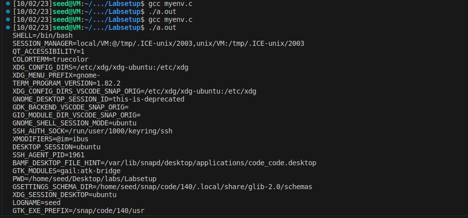

# Semana #4: Environment Variable and Set-UID Program Lab

## Tarefas

### Tarefa 1
> Como indicado no enunciado do lab, o comando `printenv` lista todas as variáveis de ambiente do sistema e o comando `printenv ENV` apenas lista as variáveis contidas no ambiente ENV. <br>
> ````bash
> $ printenv PWD # /home/seed
> ````

### Tarefa 2
> Correndo o código fornecido, obtivemos as variáveis de ambiente do processo pai e do processo filho em 2 ficheiros diferentes. A diferença entre os dois deu um resultado vazio, pelo que tirámos a conclusão de que o filho herda as variáveis de ambiente do pai deopis de executar o fork(). Assim, não há diferença no ambiente de execução. <br>


### Tarefa 3
> O código fornecido no enunciado possui o terceiro argumento do comando "execve" a NULL. Desta forma, as variáveis de ambiente não são passadas ao programa chamado, originando um output vazio. <br>
> Substituindo NULL pela variável "environ", entendemos que as variaveis de ambiente serão explicitamente passadas do processo atual para o novo programa. <br>



### Tarefa 4
> Com o comando "system()" conseguimos observar que o novo processo recebeu todas as variáveis de ambiente do processo que o chamou. <br>
> Por outro lado, com "execve()", mantem-se as variaveis de amviente do processo atual. 
? Substitui-se o processo em execução pelo processo passado no 3º argumento, so se mantendo as variaveis de ambiente se estas forem passsadas como argumento. <br>
